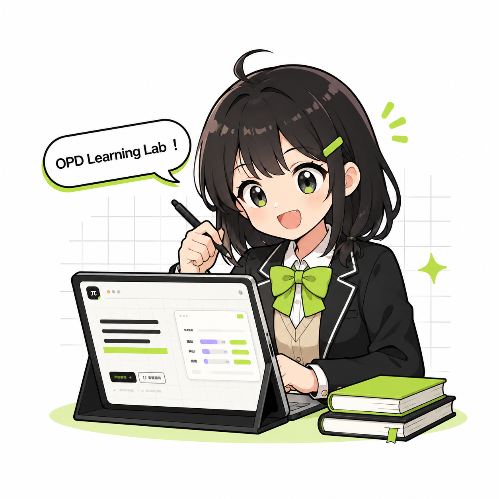

<p align="center">
  
</p>

<h1 align="center">OPD Learning Lab</h1>

<p align="center">
  <a href="https://fumadocs.dev/"></a>
  <a href="https://nextjs.org/"></a>
  <a href="https://katex.org/"></a>
  <a href="https://github.com/Palind-Rome/opd-learning-lab/actions"></a>
  <a href="https://github.com/Palind-Rome/opd-learning-lab"></a>
</p>

<p align="center">
  让学生在自己的错误上，听懂老师。<br/>
  一份从零开始、但不止于"入门"的 <strong>On-Policy Distillation</strong> 交互教程。
</p>

---

## 这是什么？

**OPD Learning Lab** 是一个面向 LLM post-training 小白的交互学习站点。它带你从 KL 散度的直觉一路走到 verl 分布式源码与 2026 年方法谱系——

- 不堆名词，先建心智模型
- 公式拆到 tensor 和 mask 的粒度
- 代码逐行对应论文
- 证据标注清楚："作者报告"、"已验证"、"待回归"

> 部署在 [blog.palind-rome.top/opd-learning-lab](https://blog.palind-rome.top/opd-learning-lab/)

## 课程结构

```
从零开始 ──→ 算法基础 ──→ OPD 核心 ──→ 源码与工程 ──→ 动手实践 ──→ 研究前沿
```

| 章节 | 你学到什么 |
|---|---|
| **从零开始** | 三分钟建立心智模型 + 补齐 softmax / log-prob 预备知识 |
| **算法基础** | SFT → KD → RL → OPD 全景图；Forward / Reverse KL；PPO 对照 |
| **OPD 核心** | 序列级 reverse KL 的目标分解；sampled / top-k / full 三种监督粒度；完整训练循环 |
| **源码与工程** | tinker-cookbook 最小 recipe；verl V1 架构、teacher rollout actor 数据流；配置与排错 |
| **动手实践** | 第一次可信试跑的完整流程；监控指标与诊断方法 |
| **研究前沿** | 常见失败模式与修复；2026 方法谱系六轴对比；分层阅读清单 |
| **参考** | 术语表 + 复现口径 |

## 交互模块

站点内置了 7 个可交互组件，不只是展示文字：

- **HeroConsole** — 首页三阶段 token 分布演示
- **PathSelector** — 初学者 / 吃透算法 / 准备跑代码三条路线
- **KLDivergenceLab** — 拖动滑块实时观察 Forward / Reverse KL / JSD 方向不对称
- **GranularityLab** — 切换 sampled / top-k / full vocabulary 理解三种监督接口
- **OPDCycle** — 一次训练 step 的五个交接点可视化
- **CompatibilityLab** — 开跑前三轴体检（重合度 / 新增能力 / 轨迹深度）
- **KnowledgeCheck** — 学完后的自测题

## 证据基础

课程内容来自一手资料的交叉核验：

- [verl 源码](https://github.com/volcengine/verl)（固定 commit `1ff76cc`，核验 **144 处**行号）
- [tinker-cookbook](https://github.com/thinking-machines-lab/tinker-cookbook)
- [AwesomeOPD](https://github.com/thinkwee/AwesomeOPD)（139 项资源导航）
- 2026 年 12+ 篇核心论文（Rethinking OPD、G-OPD / ExOPD、SCOPE、OPSD、AOPD、Prune-OPD 等）

每一条实验数字标注为"作者报告"，没有官方实现的论文明确写"未核验到源码"，推断不会伪装成结论。

## 快速开始

```bash
# 安装依赖
pnpm install

# 启动开发服务器
pnpm dev

# 构建生产版本
pnpm build

# 类型检查
pnpm types:check
```

站点使用 [Fumadocs](https://fumadocs.dev) + [Next.js](https://nextjs.org) + [KaTeX](https://katex.org) 构建，静态导出后部署在 GitHub Pages。

## 许可证

MIT
